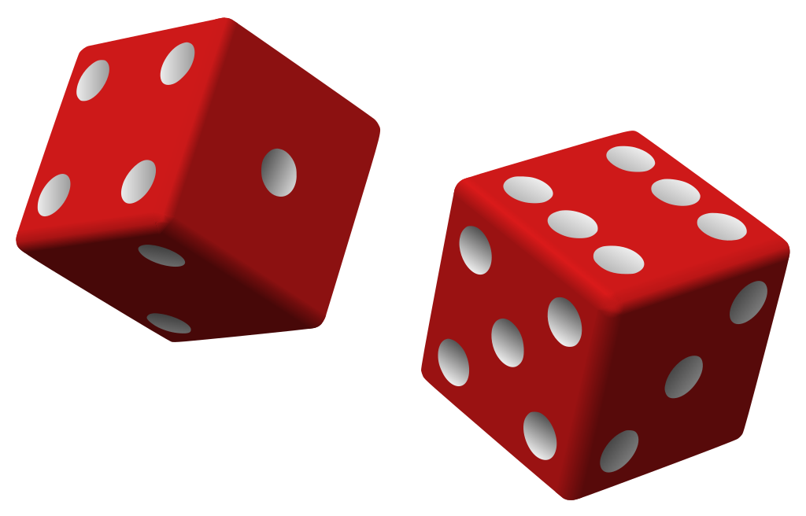

<link href="../assets/style_1.css" rel="stylesheet"/>
<link href="../assets/code.css" rel="stylesheet"/>
<script src="https://cdn.jsdelivr.net/npm/prismjs@1.25.0"></script>
<script src="https://cdn.jsdelivr.net/npm/prismjs/components/prism-python.min.js"></script>


# Tartalomjegyzék
1. [Alapértelmezett paraméterek](#alapertelmezett-parameterek)

# A játékról:
- A játékot 2 vagy 4 játékos játszhatja.
- A játék folyamán a játékosok körönként dobhatnak egy kockával.
- A dobás eredménye hozzáadódik a játékos pontjaihoz.
- Ha a játékos 1-et dob, akkor az összes eddigi pontja elveszik és a következő játékos következik.
- Ha a játékos úgy dönt, hogy megáll, akkor a pontjai hozzáadódnak a játékos összpontszámához és a következő játékos következik.

# Új dolgok:
- ## A `random` modul segítségével tudunk véletlenszámokat generálni.
    ```python
    import random

    roll = random.randint(1, 6)
    ```
    - `random.randint(a, b)` -> Visszaad egy véletlenszerű egész számot az `a` és `b` között. 
    - `random.choice(lista)` -> Visszaad egy véletlenszerű elemet a listából.

- ## A függvényeknek lehetnek alapértelmezett paraméterei.()
    ```python
    import random

    def dob(oldal_szam=6):
        roll = random.randint(1, oldal_szam)

        return roll
    ```
    - A függvényeknek lehetnek olyan paraméterei, amelyeknek alapértelmezett értéket adunk. Ha a függvényt meghívjuk és nem adunk meg új értéket az alapértelmezett paraméternek, akkor az alapértelmezett értékkel fogja végrehajtani a függvényt. 
    - Példa: `def dob(oldalSzam=6):`  
    - Ha nem adunk meg értéket a `dob` függvénynek, akkor az `oldalSzam` értéke 6 lesz.
    - Ha megadunk értéket a `dob` függvénynek, akkor az `oldalSzam` értéke az általunk megadott érték lesz. 

- ## Az `isdigit()` metódus segítségével ellenőrizhetjük, hogy egy string csak számokat tartalmaz-e. 
    ```python
    players = input("Enter the number of players (2 - 4): ")
    if players.isdigit():
        players = int(players)
    ```
    - Példa: `szam = "123"`  `szam.isdigit()`  -> True 
    - Példa: `szam = "123a"`  `szam.isdigit()`  -> False 
    - Így többet nem kell listát használnunk ehhez az ellenőrzéshez.

- ## Tudunk listákat generálni
    ```python
    jatekos_pontok = [0 for _ in range(jatekosSzam)]
    ```
    - Példa: `szamok = [i for i in range(1, 11)]`  -> [1, 2, 3, 4, 5, 6, 7, 8, 9, 10]  
    - #### Egy listában tudunk feltételes kifejezéseket is használni.
        - Példa: `szamok = [i for i in range(1, 11) if i % 2 == 0]`  -> [2, 4, 6, 8, 10]
            - A feltétel csak akkor teljesül, ha az `i` értéke páros.
        - Példa: `szamok = [i if i % 2 == 0 else 0 for i in range(1, 11)]`  -> [0, 2, 0, 4, 0, 6, 0, 8, 0, 10]
            - Ha az `i` értéke páros, akkor az `i` értékét adja a listához, ha nem, akkor 0-t ad a listához.
    - > Érdekesség: A generált listák elemei csak akkor dolgozódnak fel, amikor hozzáférünk az adott elemhez. Ez azt jelenti, hogy a generált listák nem foglalnak sok memóriát, mivel csak a szabályt tárolják, amely alapján a lista elemei generálódnak.
- ## `index()` metódus
    - A `list.index(elem)` metódus visszaadja az `elem` indexét a listában.
    - Példa: `szamok = [1, 2, 3, 4, 5]`  `index = szamok.index(3)`  -> 2
    - Ha az `elem` nem szerepel a listában, akkor hibát fog dobni.
    - > Emlékeztető: A listák indexelése 0-tól kezdődik.
        

    